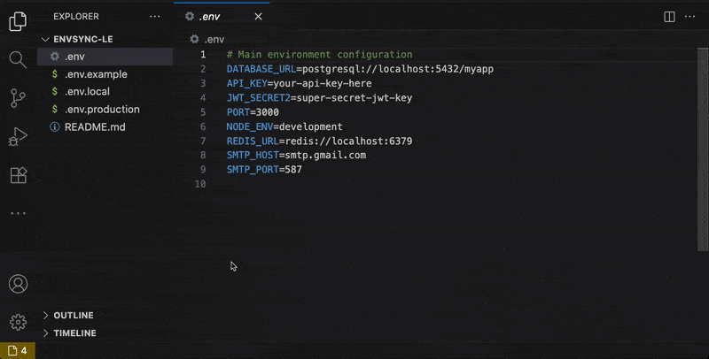
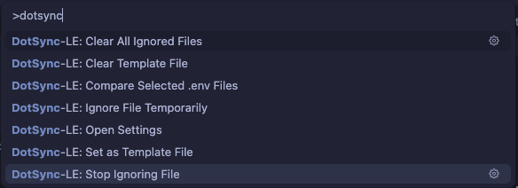

<p align="center">
  
</p>
<h1 align="center">EnvSync-LE: Zero Hassle .env Sync</h1>
<p align="center">
  <b>Effortlessly detect, compare, and synchronize .env files across your workspace.</b><br/>
  <i>Featuring visual diffs, automatic, manual, and template-based comparison modes.</i>
  <br/>
  <i>Designed for enterprise environments and large monorepos.</i>
</p>

<p align="center">
  <!-- Build -->
  <a href="https://github.com/OffensiveEdge/envsync-le/actions">
    
  </a>
</p>

<p align="center">
  <i>Tested on <b>Ubuntu</b>, <b>macOS</b>, and <b>Windows</b> for maximum compatibility.</i>
</p>

---

<p align="center">
  
</p>

<p align="center">
  
</p>

## 🙏 Thank You!

Thank you for using EnvSync-LE! If this extension has been helpful in managing your environment files, please consider leaving a rating on [VS Code Marketplace](https://marketplace.visualstudio.com/items?itemName=nolindnaidoo.envsync-le) and [Open VSX](https://open-vsx.org/extension/OffensiveEdge/envsync-le). Your feedback helps other developers discover this tool and motivates continued development.

⭐ **Enjoying EnvSync-LE?** [Leave a rating](https://marketplace.visualstudio.com/items?itemName=nolindnaidoo.envsync-le) and help others find it too!

## ✅ Why EnvSync‑LE

- **Simple sync detection**: Instantly see if your environment files are in sync.
- **One‑click details**: Click the status bar to open a comprehensive <a href="docs/SCREENSHOTS.md#sync-details-report">visual diff report</a> showing which files are out of sync and which keys are missing.
- **Clear signals**: Status bar indicators for in-sync, missing/extra keys, and parse errors.
- **Flexible modes**: Auto scan, manual selection, or compare all files to a template.
- **Noise control**: Ignore comments, toggle case sensitivity, and debounce checks.
- **Granular scope**: Include/exclude file patterns and temporarily ignore specific files.

## 🚀 More from the LE Family

**EnvSync-LE** is part of a growing family of developer tools designed to make your workflow effortless:

- **Strings-LE** - Extract every user-visible string from JSON, YAML, CSV, TOML, INI, and .env files with zero hassle  
  [[VS Code Marketplace](https://marketplace.visualstudio.com/items?itemName=nolindnaidoo.string-le)] [[Open VSX](https://open-vsx.org/extension/OffensiveEdge/string-le)]

- **Numbers-LE** - Extract and analyze numeric data from JSON, YAML, CSV, TOML, INI, and .env files  
  [[VS Code Marketplace](https://marketplace.visualstudio.com/items?itemName=nolindnaidoo.numbers-le)] [[Open VSX](https://open-vsx.org/extension/OffensiveEdge/numbers-le)]

- **Paths-LE** - Extract and analyze file paths from imports, configs, and dependencies  
  [[VS Code Marketplace](https://marketplace.visualstudio.com/items?itemName=nolindnaidoo.paths-le)] [[Open VSX](https://open-vsx.org/extension/OffensiveEdge/paths-le)]

- **Scrape-LE** - Verify page reachability and detect anti-scraping measures before deploying scrapers  
  [[VS Code Marketplace](https://marketplace.visualstudio.com/items?itemName=nolindnaidoo.scrape-le)]

- **Colors-LE** - Extract and analyze colors from CSS, HTML, JavaScript, and TypeScript  
  [[VS Code Marketplace](https://marketplace.visualstudio.com/items?itemName=nolindnaidoo.colors-le)] [[Open VSX](https://open-vsx.org/extension/OffensiveEdge/colors-le)]

- **Dates-LE** - Extract and analyze dates from logs, APIs, and temporal data  
  [[VS Code Marketplace](https://marketplace.visualstudio.com/items?itemName=nolindnaidoo.dates-le)] [[Open VSX](https://open-vsx.org/extension/OffensiveEdge/dates-le)]

- **URLs-LE** - Extract and analyze URLs from web content, APIs, and resources  
  [[VS Code Marketplace](https://marketplace.visualstudio.com/items?itemName=nolindnaidoo.urls-le)] [[Open VSX](https://open-vsx.org/extension/OffensiveEdge/urls-le)]

Each tool follows the same philosophy: **Zero Hassle, Maximum Productivity**.

## 💡 Use Cases & Examples

### Monorepo Environment Management

Keep environment variables synchronized across multiple services:

```
project/
├── frontend/.env.local
├── backend/.env.local
├── database/.env.local
└── shared/.env.template
```

### Development Team Coordination

Ensure all team members have consistent environment configurations:

```bash
# .env.development (template)
DATABASE_URL=postgresql://localhost:5432/myapp_dev
REDIS_URL=redis://localhost:6379
API_BASE_URL=http://localhost:3000

# .env.local (individual)
DATABASE_URL=postgresql://localhost:5432/myapp_dev
REDIS_URL=redis://localhost:6379
API_BASE_URL=http://localhost:3000
DEBUG_MODE=true
```

### CI/CD Pipeline Validation

Validate environment files before deployment:

```yaml
# .env.production
DATABASE_URL=postgresql://prod-db:5432/myapp
REDIS_URL=redis://prod-redis:6379
API_BASE_URL=https://api.myapp.com

# .env.staging
DATABASE_URL=postgresql://staging-db:5432/myapp
REDIS_URL=redis://staging-redis:6379
API_BASE_URL=https://staging-api.myapp.com
```

### Configuration Drift Detection

Monitor for configuration changes across different environments and alert when inconsistencies are detected.

## 🚀 Quick Start

1. **Install from VS Code Marketplace or Open VSX**
   - VS Code Marketplace: [Install here](https://marketplace.visualstudio.com/items?itemName=nolindnaidoo.envsync-le)
   - Open VSX (Cursor, VSCodium): [Install here](https://open-vsx.org/extension/OffensiveEdge/envsync-le)
2. Open a workspace containing one or more `.env*` files.
3. Watch the status bar for sync status, or run commands:
   - Compare Selected .env Files
   - Set/Clear Template
   - Ignore/Stop Ignoring/Clear All Ignored
   - Open DotSync‑LE Settings

## 🔁 Comparison Modes

- **Auto**: Discover and compare all `.env*` files automatically.
- **Manual**: You pick which files to compare.
- **Template**: Treat one file as the source of truth and compare others to it.

## 📣 Status Bar & Notifications

- In‑sync: Green check with tooltip summary.
- Out‑of‑sync: Warning with number of affected files; click to open a detailed sync report.
- Parse errors: Error state with guidance to fix.
- Notification levels: `all`, `important`, or `silent`.

## 🧾 Sync Details Report

- Open via status bar click or the command: `DotSync‑LE: Show Sync Details`.
- Summarizes checked files, overall status, and issues.
- Lists missing keys per file and the reference file used for comparison.
- Includes parse/read errors, when present.

## 🧭 Commands

- `EnvSync‑LE: Show Sync Details` (`envsync-le.showIssues`)
- `EnvSync‑LE: Open Settings` (`envsync-le.openSettings`)
- `EnvSync‑LE: Compare Selected .env Files` (`envsync-le.compareSelected`)
- `EnvSync‑LE: Set Template File` (`envsync-le.setTemplate`)
- `EnvSync‑LE: Clear Template File` (`envsync-le.clearTemplate`)
- `EnvSync‑LE: Ignore File` (`envsync-le.ignoreFile`)
- `EnvSync‑LE: Stop Ignoring File` (`envsync-le.stopIgnoring`)
- `EnvSync‑LE: Clear All Ignored Files` (`envsync-le.clearAllIgnored`)

## ⚙️ Configuration

### Basic Settings

- `envsync-le.enabled` – Enable or disable the extension
- `envsync-le.watchPatterns` – Glob patterns for files to watch (default: `**/.env*`)
- `envsync-le.excludePatterns` – Globs to exclude from watching
- `envsync-le.notificationLevel` – `all` | `important` | `silent`
- `envsync-le.statusBar.enabled` – Toggle status bar indicator

### Advanced Options

- `envsync-le.debounceMs` – Debounce time (ms) before checking sync
- `envsync-le.ignoreComments` – Ignore `#` commented lines when parsing
- `envsync-le.caseSensitive` – Case‑sensitive key comparison
- `envsync-le.comparisonMode` – `auto` | `manual` | `template`
- `envsync-le.compareOnlyFiles` – Explicit files list for manual mode
- `envsync-le.templateFile` – Template path for template mode
- `envsync-le.temporaryIgnore` – Files temporarily excluded from checks

### Real-World Configuration Examples

**Monorepo Setup**

```json
{
  "envsync-le.enabled": true,
  "envsync-le.watchPatterns": ["**/.env*", "**/config/.env*"],
  "envsync-le.excludePatterns": ["**/node_modules/**", "**/dist/**"],
  "envsync-le.comparisonMode": "template",
  "envsync-le.templateFile": ".env.template",
  "envsync-le.notificationLevel": "important"
}
```

**Development Team**

```json
{
  "envsync-le.enabled": true,
  "envsync-le.watchPatterns": ["**/.env*"],
  "envsync-le.ignoreComments": true,
  "envsync-le.caseSensitive": false,
  "envsync-le.debounceMs": 1000,
  "envsync-le.notificationLevel": "all"
}
```

**CI/CD Pipeline**

```json
{
  "envsync-le.enabled": true,
  "envsync-le.comparisonMode": "manual",
  "envsync-le.compareOnlyFiles": [".env.production", ".env.staging"],
  "envsync-le.notificationLevel": "silent",
  "envsync-le.statusBar.enabled": false
}
```

## 🌍 English + 12 translations

- Chinese (Simplified), Spanish, French, Russian, Portuguese (Brazil)
- Japanese, Korean, German, Italian, Vietnamese, Ukrainian, Indonesian

## 🧩 System Requirements

- **VS Code**: 1.70.0 or higher
- **Node.js**: Not required (extension runs in VS Code's built-in runtime)
- **Platform**: Windows, macOS, Linux
- **Memory**: 30MB minimum, 100MB recommended for large workspaces
- **Storage**: 10MB for extension files

## 🧩 Compatibility

- Works in standard workspaces.
- Limited support in virtual/untrusted workspaces (no file watching in some cases).

## ⚡ Performance

EnvSync-LE is optimized for workspace monitoring:

| Operation           | Performance   | File Count Range | Hardware Tested  |
| ------------------- | ------------- | ---------------- | ---------------- |
| **File Detection**  | <100ms        | 1-1000 files     | M1 Mac, Intel i7 |
| **Sync Comparison** | 50K+ keys/sec | 1-100 files      | M1 Mac, Intel i7 |
| **Status Updates**  | <50ms         | Real-time        | M1 Mac, Intel i7 |
| **Large Workspace** | <500ms        | 1000+ files      | M1 Mac, Intel i7 |

### Performance Notes

- **Memory Usage**: ~30MB base + 1MB per 100 .env files monitored
- **File Watching**: Debounced to prevent excessive processing (configurable)
- **Large Workspaces**: Monitors up to 10,000 .env files efficiently
- **Real-time Updates**: Status bar updates within 50ms of file changes
- **Hardware Requirements**: Minimum 2GB RAM, recommended 4GB+ for large workspaces

## 🔒 Privacy & Telemetry

- Runs locally; no data is sent off your machine.
- Optional local‑only logs can be enabled with `envsync-le.telemetryEnabled`.

## 🔧 Troubleshooting

### Common Issues

**Status bar not showing sync status**

- Ensure workspace contains `.env*` files
- Check that `envsync-le.statusBar.enabled` is set to `true`
- Verify `envsync-le.enabled` is `true` in settings
- Try reloading VS Code window (`Ctrl/Cmd + Shift + P` → "Developer: Reload Window")

**Files not being detected**

- Check `envsync-le.watchPatterns` includes your file patterns (default: `**/.env*`)
- Ensure files are not excluded by `envsync-le.excludePatterns`
- Verify files are not in `envsync-le.temporaryIgnore` list

**Sync comparison issues**

- Check `envsync-le.caseSensitive` setting matches your environment
- Ensure `envsync-le.ignoreComments` is appropriate for your files
- Verify comparison mode (`auto`, `manual`, `template`) is correctly configured

**Performance issues**

- Increase `envsync-le.debounceMs` for large workspaces
- Use `envsync-le.temporaryIgnore` for files you don't need to monitor
- Consider reducing `envsync-le.notificationLevel` to `important` or `silent`

**Parse errors in .env files**

- Check for malformed key-value pairs
- Ensure quotes are properly closed
- Verify no special characters in keys without proper escaping

**Extension crashes or freezes**

- Check VS Code version compatibility (requires 1.70.0+)
- Disable other environment-related extensions temporarily
- Check Output panel → "EnvSync-LE" for error messages

### Getting Help

- Check the [Issues](https://github.com/OffensiveEdge/envsync-le/issues) page for known problems
- Enable telemetry logging: `envsync-le.telemetryEnabled: true`
- Review logs in Output panel → "EnvSync-LE"

## ❓ FAQ

**Q: What file patterns are watched by default?**
A: EnvSync-LE watches `**/.env*` files by default, which includes .env, .env.local, .env.production, etc. You can customize this with `envsync-le.watchPatterns`.

**Q: How do I ignore specific files?**
A: Use `envsync-le.temporaryIgnore` to temporarily ignore files, or `envsync-le.excludePatterns` for permanent exclusions using glob patterns.

**Q: What's the difference between comparison modes?**
A: **Auto** discovers and compares all .env files automatically. **Manual** lets you pick which files to compare. **Template** treats one file as the source of truth.

**Q: Can I make comparisons case-sensitive?**
A: Yes, enable `envsync-le.caseSensitive: true` to make key comparisons case-sensitive. This is useful when your environment variables have specific casing requirements.

**Q: How do I handle comments in .env files?**
A: Enable `envsync-le.ignoreComments: true` to ignore lines starting with `#` when parsing .env files for comparison.

**Q: What's the largest workspace supported?**
A: EnvSync-LE can monitor up to 10,000 .env files efficiently. For larger workspaces, consider using exclude patterns to limit the scope.

## 📊 Test Coverage

- 45 passing unit tests across 5 test suites
- **97.65% function coverage, 95.08% line coverage**
- Tests powered by Vitest with V8 coverage
- Runs quickly and locally: `bun test` or `bun test --coverage`
- Coverage reports output to `coverage/` (HTML summary at `coverage/index.html`)
- Core logic is designed for unit testing; additional suites will expand over time

---

Copyright © 2025
<a href="https://github.com/OffensiveEdge">@OffensiveEdge</a>. All rights reserved.
