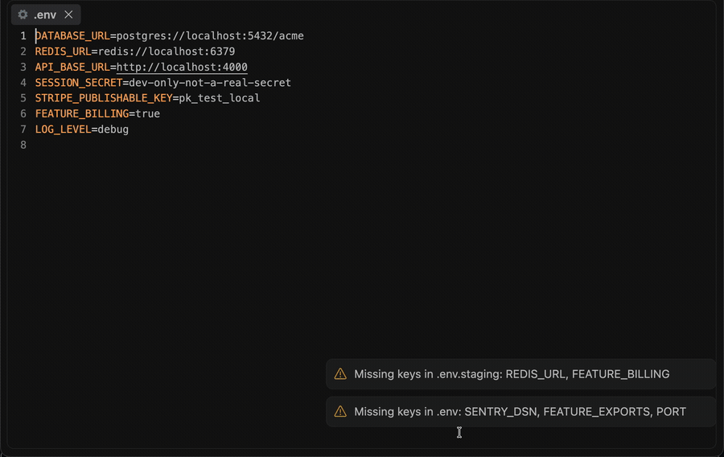

<p align="center">
  
</p>
<h1 align="center">EnvSync-LE: Zero Hassle .env Sync</h1>
<p align="center">
  <b>Spot missing keys across your .env files before they bite</b><br/>
  <i>Automatic checks, a status bar counter, and a plain markdown report</i>
</p>

<p align="center">
  <a href="https://marketplace.visualstudio.com/items?itemName=nolindnaidoo.envsync-le">
    
  </a>
  <a href="https://open-vsx.org/extension/OffensiveEdge/envsync-le">
    
  </a>
  <a href="https://www.npmjs.com/package/envsync-le-mcp">
    
  </a>
  <a href="https://letools.dev/tools/envsync-le">
    
  </a>
</p>

---

<p align="center">
  
</p>

> **Useful?** A star or rating is how other developers find it —
> [★ GitHub](https://github.com/nolindnaidoo/envsync-le) ·
> [★ Open VSX](https://open-vsx.org/extension/OffensiveEdge/envsync-le/reviews) ·
> [★ Marketplace](https://marketplace.visualstudio.com/items?itemName=nolindnaidoo.envsync-le&ssr=false#review-details)

## What it does

EnvSync-LE compares the **variable names** across the `.env` files in your
workspace and tells you which files are missing which keys. It never reads
or compares values, and it never modifies your files. Works in VS Code and
in VS Code–based editors like Cursor and VSCodium (installable from Open VSX).

- **Automatic checks** — a debounced sync check runs whenever a watched `.env` file changes
- **Status bar counter** — the current issue count, one click away from the full report
- **Markdown report** — `Show Details` (`Ctrl+Alt+S` / `Cmd+Alt+S`) lists every missing key per file
- **Three comparison modes** — `auto` (union of all keys), `manual` (only the files you list), `template` (validate everything against one reference file; also reports keys a file has that the template lacks)
- **Ignore list** — temporarily exclude files (e.g. `.env.example`) from checking

## Use it from an AI agent

The same engine runs as an [MCP](https://modelcontextprotocol.io) server, so an agent can call it directly instead of you running a command.

| Editor | How |
|---|---|
| **VS Code** 1.101+ | Nothing to install — the extension registers `compare_env_files` with agent mode |
| **Zed** | No listing yet — [add the MCP server by hand](https://zed.dev/docs/ai/mcp) |
| **Claude Code** | `claude mcp add envsync-le -- npx -y envsync-le-mcp` |
| **Cursor, Windsurf, anything else** | point it at `npx envsync-le-mcp` |

```
compare_env_files(files[], mode?, templatePath?, caseSensitive?, maxResults?)
```

Takes file contents directly and reports which keys are missing from which file. **Only key names are returned, never values** — a dotenv file is where credentials live and the answer does not need them.

The server takes content and returns data — it reads no files and makes no network requests of its own. Published as [`envsync-le-mcp`](https://www.npmjs.com/package/envsync-le-mcp) on npm and as `io.github.nolindnaidoo/envsync-le` in the [MCP registry](https://registry.modelcontextprotocol.io).

<details>
<summary><b>Configuring it by hand</b> — any host with an MCP config file</summary>

Most hosts read a JSON config. Add one entry:

```json
{
  "mcpServers": {
    "envsync-le": {
      "command": "npx",
      "args": ["-y", "envsync-le-mcp"]
    }
  }
}
```

`-y` skips the install prompt on first run. Pin a version if you would rather not track releases — `envsync-le-mcp@2.2.1`.

Prefer not to go through `npx` on every launch? Install it once and point at the binary instead:

```bash
npm install -g envsync-le-mcp
```

```json
{
  "mcpServers": {
    "envsync-le": { "command": "envsync-le-mcp" }
  }
}
```

It speaks MCP over stdio and needs no environment variables, no API key and no configuration of its own. To check it before wiring it into anything:

```bash
echo '{"jsonrpc":"2.0","id":1,"method":"tools/list"}' | npx -y envsync-le-mcp
```

That prints the tool list and exits — if you see `compare_env_files`, the server works.

</details>

## File classification

| Filename | Type |
|---|---|
| `.env` | base |
| `.env.local`, `.env.*.local` | local override |
| `.env.example`, `.env.template` | template |
| `.env.production`, `.env.prod` | production |
| `.env.development`, `.env.dev` | development |
| `.env.test` | test |
| `anything.env`, unknown segments | base |

Classification is segment-based on the basename — `app.device.env` is not
"development", and Windows paths classify correctly.

## The CLI

The same comparison runs from a terminal or a CI step: a Rust CLI in
[`crate/`](crate/README.md), sharing one corpus with the extension —
[`crate/fixtures/`](crate/fixtures/) — so the two can never read a
dotenv file differently.

```bash
envsync-le .                            # have these environments drifted?
envsync-le --template .env.example .    # will this deploy break?
envsync-le mcp                          # the same comparison over MCP on stdio
```

```
.env: missing STRIPE_KEY, SENTRY_DSN (in .env.example)
.env.production: missing SENTRY_DSN (in .env.example)
out of sync — 2 files with mismatches across 3 files
```

**The exit code is the product** — 0 in sync, 1 out of sync, 2 malformed
question. Finding no dotenv files at all is 0: there is nothing to be out
of sync with. Unlike the extractors in this family there is no list to
pipe onward; the number is the answer.

**It never reads a value.** Only key names are parsed, compared or
reported, and three separate checks enforce that rather than a promise.

Install it with `cargo install envsync-le` once it is published; until
then it builds from `crate/`. The spec
([`crate/SPEC.md`](crate/SPEC.md)) and the engineering standard
([`crate/AGENTS.md`](crate/AGENTS.md)) live alongside it, and it keeps
its own [CHANGELOG](crate/CHANGELOG.md).

**Two MCP servers, one tool.** `envsync-le mcp` offers
`compare_env_files` exactly as
[`envsync-le-mcp`](https://www.npmjs.com/package/envsync-le-mcp) does —
[`crate/fixtures/mcp-compare-env-files.json`](crate/fixtures/mcp-compare-env-files.json)
runs against both and CI fails if they diverge.

## Commands

| Command | Description |
|---|---|
| `EnvSync-LE: Show Details` (`Ctrl+Alt+S` / `Cmd+Alt+S`) | Run a sync check and open the markdown report |
| `EnvSync-LE: Compare Files` | Compare the key sets of two or more selected `.env` files |
| `EnvSync-LE: Set Template` | Mark a `.env` file as the reference template |
| `EnvSync-LE: Clear Template` | Return to automatic comparison |
| `EnvSync-LE: Ignore File` | Exclude a `.env` file from sync checking |
| `EnvSync-LE: Unignore File` | Re-include a previously ignored file |
| `EnvSync-LE: Clear Ignored Files` | Empty the ignore list |
| `EnvSync-LE: Open Settings` | Open VS Code settings filtered to EnvSync-LE |
| `EnvSync-LE: Help & Troubleshooting` | Built-in documentation |

## Settings

| Setting | Default | Description |
|---|---|---|
| `envsync-le.enabled` | `true` | Master switch for sync checking |
| `envsync-le.watchPatterns` | `[".env*"]` | Glob patterns for files to watch and compare |
| `envsync-le.excludePatterns` | `[]` | Glob patterns to exclude; patterns without `/` match the basename (so `.env.*.local` excludes nested files too) |
| `envsync-le.notificationLevel` | `important` | `all` = missing + extra keys, `important` = missing keys + errors, `silent` = nothing |
| `envsync-le.statusBar.enabled` | `true` | Show the status bar item (applies immediately) |
| `envsync-le.debounceMs` | `1000` | Delay between a file change and the sync check |
| `envsync-le.caseSensitive` | `true` | Treat `DB_URL` and `db_url` as different keys |
| `envsync-le.comparisonMode` | `auto` | `auto`, `manual`, or `template` |
| `envsync-le.compareOnlyFiles` | `[]` | In manual mode, only compare these files (workspace-relative) |
| `envsync-le.templateFile` | — | The reference file for template mode (set via `Set Template`) |
| `envsync-le.temporaryIgnore` | `[]` | Files currently ignored (managed by the ignore commands) |
| `envsync-le.telemetryEnabled` | `false` | Local-only event log (see Privacy) |

## Parsing notes

- Keys must match `[A-Za-z_][A-Za-z0-9_-]*`; anything else left of `=` is
  reported as a parse error for that line (the rest of the file still counts).
- `export KEY=value` is accepted; duplicate keys count once.
- Values quoted with `"`, `'`, or `` ` `` may span multiple lines; an
  unterminated quote is reported as an error.
- In `auto` mode the reference is the union of all keys, so "extra keys"
  only exist in `template` mode.

## Languages

Twelve languages besides English:

German · Spanish · French · Indonesian · Italian · Japanese · Korean ·
Portuguese (Brazil) · Russian · Ukrainian · Vietnamese · Chinese (Simplified)

Both halves are covered — the manifest (command titles, setting names and
descriptions) and everything shown while the extension runs (notifications,
the status bar, quick-picks and prompts). The extension follows VS Code's
display language, so it matches whatever the editor is already set to; no
setting of its own.

## Privacy & security

- **No network access.** The extension never sends data anywhere. The
  `telemetryEnabled` setting only writes events to a local Output Channel
  you can inspect (`envsync-le`).
- **Values are never read, displayed, or logged** — only key names are compared.
- **The MCP server returns key names, never values.** A dotenv file is where credentials live, so the server reports which keys are missing or extra and nothing about what they contain. It takes file contents as an argument rather than paths, so it reads no files and makes no network calls; the bundle gate asserts a known value is absent from its response.
- Error notifications redact home directories and credential-shaped fragments.

## Development

```bash
bun install
bun run build            # esbuild bundle -> dist/extension.js
bun run typecheck        # tsc --noEmit (includes tests)
bun run test             # vitest unit suite
bun run test:integration # real VS Code extension host
bun run lint             # biome
bun run package          # VSIX into release/
```

Architecture and conventions live in [AGENTS.md](AGENTS.md). Changes are tracked in [CHANGELOG.md](CHANGELOG.md).

## Performance

<!-- performance:start -->
| Input | Size | Found | Time | Rate | Scan speed |
| --- | --- | --- | --- | --- | --- |
| 4 files x 500 keys | 0.02 MB | 1,910 | 0.18 ms | 10,816,443/sec | 102.3 MB/s |
| 24 files x 500 keys | 0.11 MB | 11,103 | 0.84 ms | 13,263,252/sec | 125.5 MB/s |
| 4 files x 8,000 keys | 0.32 MB | 31,172 | 1.48 ms | 21,071,644/sec | 218.4 MB/s |

Median of 7 runs after warmup, on Apple M5 Pro, 24 GB RAM, Node 24.3.0. Inputs are generated
by `scripts/benchmark.ts` rather than checked in, so the sizes above are
exactly what was measured. Reproduce with `bun run benchmark`.

These are machine-specific and are not asserted in CI — a benchmark that gates
a build only tells you how busy the runner was.
<!-- performance:end -->

## Testing

<!-- coverage:start -->
| Metric | Coverage |
| --- | --- |
| Statements | 89.95% |
| Branches | 84.00% |
| Functions | 93.24% |
| Lines | 90.28% |

172 test cases across 13 files, plus an integration suite that runs
in a real VS Code extension host and an end-to-end test that installs the
built `.vsix` into a clean profile.

Generated from `coverage/coverage-summary.json` by
`scripts/coverage-readme.js`; CI fails if this section drifts from a fresh
run. Reproduce with `bun run test:coverage`.
<!-- coverage:end -->

## More from the LE family

Sixteen single-purpose tools for the work in front of every model. Each ships
a Rust CLI and an MCP server. One page: **[letools.dev](https://letools.dev)**

**Get it out**

- **[String-LE](https://letools.dev/tools/string-le)** — Extract every string in a codebase, with its position, so a person can read them
- **[Numbers-LE](https://letools.dev/tools/numbers-le)** — Extract every hardcoded number in a codebase, so a person can check them
- **[Units-LE](https://letools.dev/tools/units-le)** — Extract every quantity with its unit, normalized, and refuse the ambiguous ones by name
- **[Dates-LE](https://letools.dev/tools/dates-le)** — Extract every date and timestamp, and the exact instant each one resolves to
- **[IDs-LE](https://letools.dev/tools/ids-le)** — Extract every UUID, ULID, NanoID, ObjectId and Snowflake, and decode the time inside
- **[IPs-LE](https://letools.dev/tools/ips-le)** — Extract every IP address, CIDR block and MAC, normalized and classified by scope
- **[URLs-LE](https://letools.dev/tools/urls-le)** — Extract every URL in a codebase, with its protocol and exact position
- **[Paths-LE](https://letools.dev/tools/paths-le)** — Extract every file path in a codebase, and say whether it still points at anything
- **[Colors-LE](https://letools.dev/tools/colors-le)** — Extract every color in a codebase, and say which ones are not in your palette

**Check it**

- **[Regex-LE](https://letools.dev/tools/regex-le)** — Find every regex in a codebase, and report which can be driven into catastrophic backtracking
- **[Versions-LE](https://letools.dev/tools/versions-le)** — Find where one dependency is constrained differently across a repository's manifests
- **[i18n-LE](https://letools.dev/tools/i18n-le)** — Identify the i18n library a project uses, then audit its catalogs by that library's rules
- **[Scrape-LE](https://letools.dev/tools/scrape-le)** — Check whether a page is scrapeable before the scraper is written, and say when it cannot tell

**Guard it**

- **[Secrets-LE](https://letools.dev/tools/secrets-le)** — Find hardcoded credentials in a codebase, and never print one into the report
- **[EnvSync-LE](https://letools.dev/tools/envsync-le)** — Compare the dotenv files in a tree, and say which keys are missing from which
- **[Unicode-LE](https://letools.dev/tools/unicode-le)** — Find the Unicode that hides meaning — bidi controls, invisibles, homoglyphs, mixed scripts

Each stands on its own: no shared crate, no published core. Where two of them
agree, it is because the same answer was right twice.

**Contact** — [nolindnaidoo.com](https://nolindnaidoo.com) · [GitHub](https://github.com/nolindnaidoo) · [LinkedIn](https://www.linkedin.com/in/nolindnaidoo/)
## Also by nolindnaidoo

**Rust** — pixelcoords and pixelactions are one loop: pixelcoords answers
*where*, pixelactions *acts* there. Their own tools, their own voice — not
part of the LE family.

- **[pixelcoords](https://github.com/nolindnaidoo/pixelcoords)** — Freeze your screen, mark regions, get pixel-exact coordinates and crops
  [pixelcoords.dev](https://pixelcoords.dev) · [crates.io](https://crates.io/crates/pixelcoords) · [docs.rs](https://docs.rs/pixelcoords)
- **[pixelactions](https://github.com/nolindnaidoo/pixelactions)** — Consume human-verified coordinates, perform the interaction, confirm it landed
  [pixelactions.dev](https://pixelactions.dev) · [crates.io](https://crates.io/crates/pixelactions) · [docs.rs](https://docs.rs/pixelactions)

## License

MIT © [nolindnaidoo](https://github.com/nolindnaidoo)
