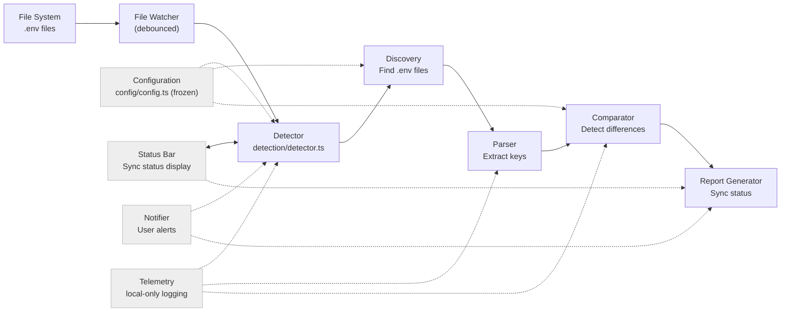
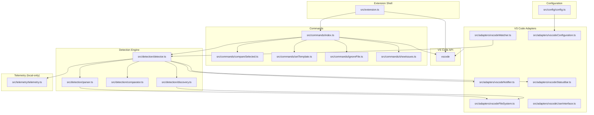

# EnvSync-LE Architecture

Technical architecture, design patterns, and system boundaries for production-grade .env file synchronization at enterprise scale.

## Core Structure

```
src/
├── extension.ts          # Minimal activation - registers commands/watchers
├── types.ts             # Core type definitions and interfaces
├── commands/            # Command implementations with dependency injection
│   ├── index.ts         # Centralized command registration
│   ├── compareSelected.ts # Manual file comparison
│   ├── setTemplate.ts   # Template mode configuration
│   ├── ignoreFile.ts    # File exclusion management
│   └── showIssues.ts    # Sync report display
├── detection/           # .env sync detection engine
│   ├── detector.ts      # Main orchestrator for sync checking
│   ├── parser.ts        # .env file parsing and key extraction
│   ├── comparator.ts    # File comparison and diff calculation
│   └── discovery.ts     # File finding and categorization
├── config/              # Configuration management
│   ├── config.ts        # Main config reader with frozen objects
│   └── settings.ts      # VS Code settings command registration
├── adapters/            # VS Code API abstractions
│   ├── vscodeConfiguration.ts # Configuration interface
│   ├── vscodeFileSystem.ts    # File system operations
│   ├── vscodeNotifier.ts      # Notification management
│   ├── vscodeStatusBar.ts     # Status bar updates
│   ├── vscodeTelemetry.ts     # Local-only logging
│   ├── vscodeUserInterface.ts # UI prompts and messages
│   └── vscodeWatcher.ts       # File watching with debounce
└── telemetry/           # Local-only logging
    └── telemetry.ts     # Output channel factory
```

## Runtime Flow



Key properties:

- Configuration is read once per check and exposed as immutable objects
- File watching is debounced to prevent excessive checks
- All errors are handled gracefully with user feedback
- Sync reports include missing keys, extra keys, and parse errors

## Module Boundaries and Dependencies



Conventions:

- All factory outputs are immutable; data structures use `readonly` and `Object.freeze()`
- Dependency injection is used throughout; `src/extension.ts` stays thin
- Adapters isolate VS Code API from core business logic
- Modules prefer pure functions with explicit return types

---

## Architectural Principles

- **Minimal activation**: `src/extension.ts` wires dependencies and registers disposables only
- **Pure core**: detection, parsing, and comparison are pure functions with explicit return types
- **Immutable data**: config and results are frozen; no in-place mutations
- **Adapter pattern**: VS Code APIs abstracted behind testable interfaces
- **Debounced watching**: File changes trigger checks after configurable delay
- **Progressive disclosure**: Status bar feedback; notifications only when needed

## Design Rationale

### Why Adapter Pattern for VS Code APIs

**Decision**: Abstract all VS Code API calls behind adapter interfaces.

**Rationale**:

- Core business logic (parsing, comparison) can be tested without VS Code runtime
- Adapters can be swapped for different editors or CLI tools
- Easier to mock for unit tests than direct VS Code API calls
- Clear separation of concerns: core logic vs. editor integration

**Trade-off**: Extra indirection layer, but testability and portability justify the cost.

### Debounced File Watching

**Decision**: Debounce file system events before triggering sync checks.

**Rationale**:

- Batch tools (Webpack, Vite) can trigger hundreds of events in milliseconds
- Prevents UI thrashing and excessive CPU usage
- Configurable delay allows tuning for different workflows
- User can disable if immediate feedback is critical

**Trade-off**: Slight delay in sync status updates, but prevents performance issues in large monorepos.

### Three Comparison Modes

**Decision**: Support auto, manual, and template comparison modes.

**Rationale**:

- **Auto**: Zero-config for simple projects
- **Manual**: Fine-grained control for complex setups
- **Template**: Single source of truth for teams

**Trade-off**: Increased complexity in comparator logic, but handles diverse real-world scenarios.

### Performance Monitoring Classes

**Decision**: Use classes for `PerformanceMonitor` and `PerformanceTracker` instead of factory functions.

**Rationale**:

- Stateful performance tracking requires encapsulated mutable state (timers, metrics)
- Class lifecycle methods (`startTimer`/`endTimer`) provide clearer semantics than closures
- Internal state mutations are intentionally hidden from consumers
- Created via factory function `createPerformanceMonitor()` to maintain consistency with codebase patterns

**Scope**: Limited to performance utilities only. All other services use factory functions.

**Trade-off**: Deviation from pure functional pattern, but classes provide better encapsulation for this specific use case.

## Component Responsibilities

- **`commands/*`**: Orchestrate user interactions, invoke detector, present results
- **`detection/*`**: Core sync detection logic (discover, parse, compare, report)
- **`adapters/*`**: Abstract VS Code APIs for testability and portability
- **`config/config.ts`**: Read, validate, freeze, and expose settings
- **`telemetry/telemetry.ts`**: Local-only Output channel logging

### Public Interfaces

```ts
export type DotenvFile = Readonly<{
  path: string
  type: 'base' | 'local' | 'example' | 'template' | 'other'
  keys: readonly string[]
  lastModified: number
}>

export type SyncReport = Readonly<{
  status: 'in-sync' | 'out-of-sync' | 'error'
  files: readonly DotenvFile[]
  missingKeys: readonly MissingKey[]
  extraKeys: readonly ExtraKey[]
  errors: readonly ParseError[]
  lastChecked: number
}>

export type EnvSyncConfig = Readonly<{
  enabled: boolean
  watchPatterns: readonly string[]
  excludePatterns: readonly string[]
  notificationLevel: 'all' | 'important' | 'silent'
  debounceMs: number
  ignoreComments: boolean
  caseSensitive: boolean
  comparisonMode: 'auto' | 'manual' | 'template'
  compareOnlyFiles: readonly string[]
  templateFile: string
  temporaryIgnore: readonly string[]
  statusBar: Readonly<{ enabled: boolean }>
  telemetryEnabled: boolean
}>
```

## Sequence: Sync Check Flow

```mermaid
sequenceDiagram
  participant FS as File System
  participant W as Watcher
  participant DET as detector.ts
  participant DIS as discovery.ts
  participant PAR as parser.ts
  participant CMP as comparator.ts
  participant UI as Status Bar

  FS->>W: .env file modified
  W->>W: Debounce (configurable delay)
  W->>DET: triggerSync()
  DET->>DIS: findDotenvFiles()
  DIS-->>DET: readonly DotenvFile[]
  DET->>PAR: parseDotenvFile() for each
  PAR-->>DET: readonly keys[], errors[]
  DET->>CMP: compareFiles(files, config)
  CMP-->>DET: SyncReport
  DET->>UI: updateStatus(report)
  DET->>UI: notify if out-of-sync
```

## Dependency Injection Contracts

```ts
export function registerAllCommands(
  context: vscode.ExtensionContext,
  deps: Readonly<{
    detector: Detector
    fileSystem: FileSystem
    ui: UserInterface
    telemetry: Telemetry
  }>,
): void
```

Guidelines:

- Construct all adapters at activation; pass to command registrars and detector
- Keep all state within function scope or minimal module closures; avoid globals
- Detector is created once and reused; stateless except for last report cache

## Cross-Cutting Concerns

- **Localization**: Manifest strings in `package.nls*.json`; runtime via `vscode-nls` with `MessageFormat.file`
- **Telemetry**: Local-only; off by default; outputs to Output panel
- **Debouncing**: Configurable delay prevents excessive sync checks
- **Error handling**: All file operations wrapped in try-catch; graceful degradation

## Extensibility Playbooks

- **Add comparison mode**: Extend `comparisonMode` type, implement in `comparator.ts`, add tests
- **Add file type**: Extend `DotenvFile` type, update `discovery.ts` categorization
- **Add command**: Create factory in `commands/`, declare in `package.json`, wire registration
- **Add setting**: Update `package.json` contributes, localize, read/validate in config

## Performance Budgets

- File discovery: <100ms for workspaces with <1000 .env files
- Parsing: <10ms per file for typical .env files (<1KB)
- Comparison: <50ms for <100 files
- Debounce default: 1000ms (configurable)
- Memory: <10MB for typical workspace

## Security & Privacy

- No network calls; all processing is local
- Respect workspace trust and virtual workspace limitations
- Validate file paths to prevent traversal attacks
- .env file contents never logged or transmitted

## Error Handling Strategy

### Error Categories

- **Parse errors**: Malformed .env files
- **File system errors**: Missing files, permission issues
- **Configuration errors**: Invalid settings
- **User errors**: Invalid selections, cancelled operations

### Recovery Approach

- Continue operation when possible (skip problematic files)
- Clear error messages with actionable suggestions
- Detailed error information in telemetry logs
- Automatic retry for transient file system errors (with bounds)

---

**Project:** [Issues](https://github.com/OffensiveEdge/envsync-le/issues) • [Pull Requests](https://github.com/OffensiveEdge/envsync-le/pulls) • [Releases](https://github.com/OffensiveEdge/envsync-le/releases)

**Docs:** [Architecture](ARCHITECTURE.md) • [Testing](TESTING.md) • [Performance](PERFORMANCE.md) • [Commands](COMMANDS.md) • [Configuration](CONFIGURATION.md) • [Development](DEVELOPMENT.md) • [Troubleshooting](TROUBLESHOOTING.md) • [Privacy](PRIVACY.md)
