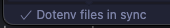
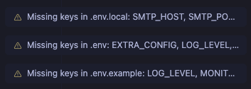
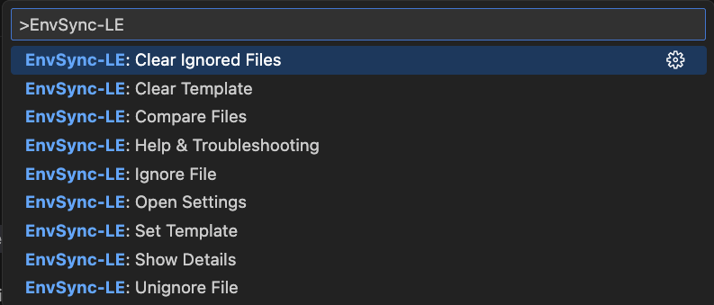
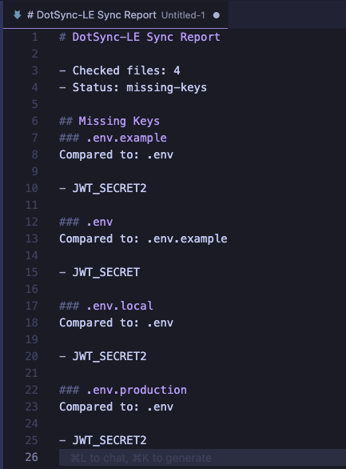

# Screenshots

These examples show how envsync-le surfaces sync status and actions in VS Code.

## Status Bar — In Sync

- Green check indicates all discovered `.env*` files have matching keys.
- Tooltip confirms everything is in sync.

## Status Bar — Out of Sync

- Warning icon shows the number of files with key mismatches or issues.
- Click the status bar to open a detailed Sync Details report.

## Notifications

- Clear messages for missing keys and parse/read errors.
- Honors `envsync-le.notificationLevel` (`all`, `important`, `silent`).

## Command Palette

- Quickly run: Show Sync Details, Compare Selected, Set/Clear Template, Ignore/Stop Ignoring.
- Use Manual or Template modes to control comparison behavior.

## Sync Details Report

- One‑click report listing out‑of‑sync files and offending keys.
- Notes the reference file used for comparison and includes parse/read errors when present.

